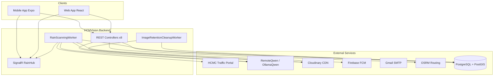
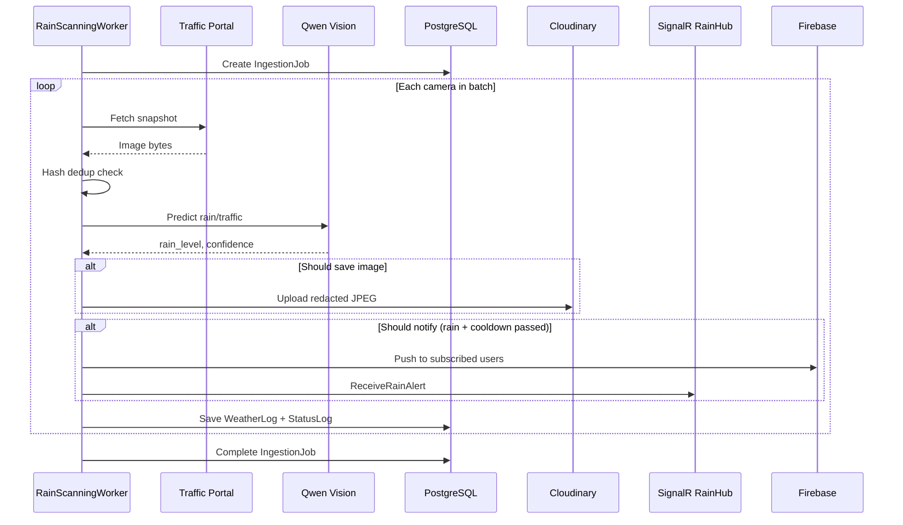
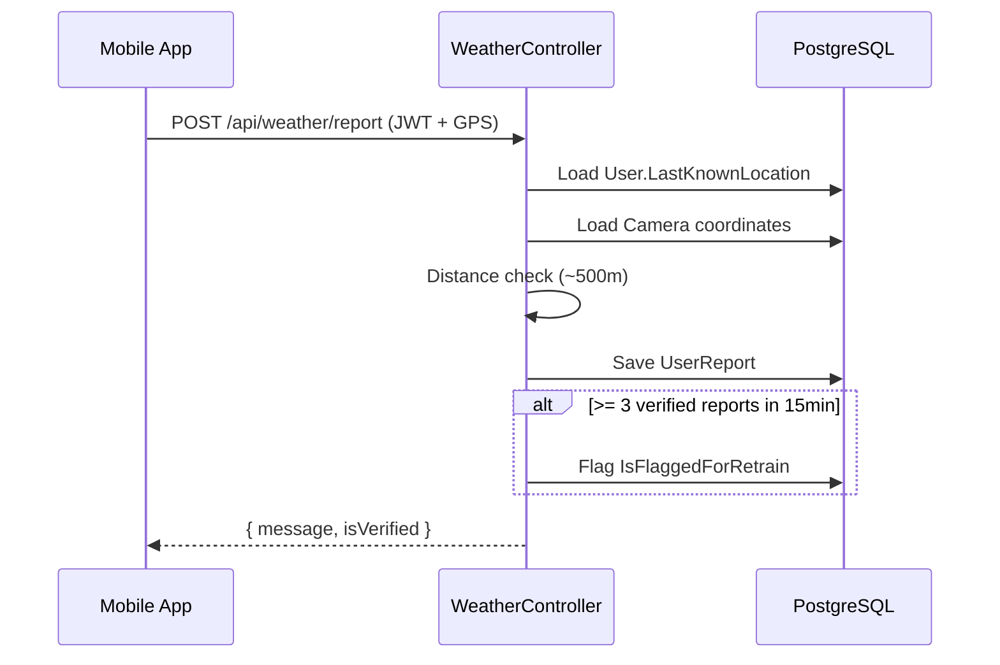
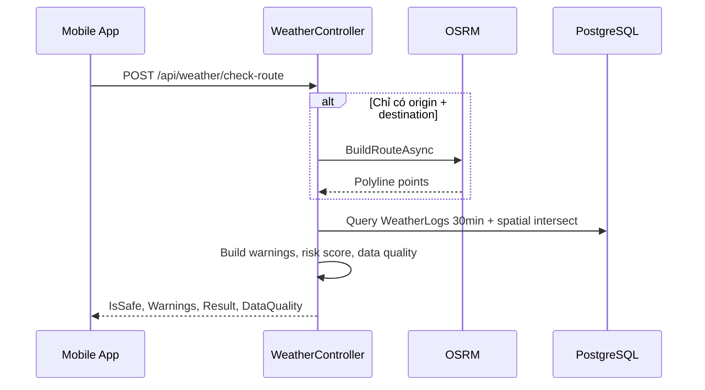
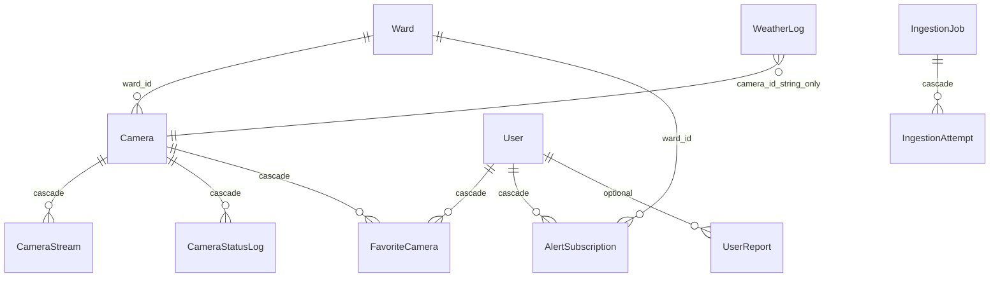

# HCMRainVision — Mô Tả Dự Án Backend

> **Phiên bản tài liệu:** 1.0  
> **Phạm vi:** Chỉ mô tả backend (`HCMVision.Backend/`)  
> **Mục đích:** Cung cấp bối cảnh kỹ thuật đầy đủ để thiết kế mobile app, viết prompt Stitch, hoặc onboard dev mới  
> **Ngôn ngữ:** Tiếng Việt (thuật ngữ kỹ thuật giữ nguyên tiếng Anh)

---

## 1. Tóm Tắt Dự Án (Executive Summary)

### 1.1 Tên và mục tiêu

| Hạng mục | Nội dung |
|----------|----------|
| **Tên sản phẩm** | HCMRainVision / HCMVision |
| **Tên assembly backend** | `HcmcRainVision.Backend` |
| **Vấn đề giải quyết** | Người dân TP.HCM cần biết tình trạng mưa ngập theo thời gian thực khi di chuyển, nhưng dữ liệu thời tiết truyền thống không đủ chi tiết theo từng khu vực nhỏ |
| **Giải pháp** | Backend tự động crawl ảnh từ camera giao thông công cộng TP.HCM, phân tích bằng AI vision (Qwen3-VL) để nhận diện mức mưa và giao thông, lưu kết quả có tọa độ GIS, và phân phối qua REST API + SignalR + Firebase push |

### 1.2 Vai trò backend trong hệ sinh thái

Backend là **trung tâm dữ liệu và xử lý** của hệ thống:

- **Mobile app (Expo/React Native):** Consumer chính — bản đồ, cảnh báo, favorites, chatbot, route check
- **Web app (React):** Tham chiếu trong tài liệu dự án; consume cùng API
- **Admin dashboard:** Quản trị camera, user, ingestion jobs — thường qua web hoặc mobile admin stack

Backend **không** render UI; nó cung cấp:

1. REST API (~52 endpoints)
2. SignalR hub realtime (`/rainHub`)
3. Background workers (quét camera, dọn ảnh)
4. Tích hợp AI, Cloudinary, FCM, SMTP

---

## 2. Bối Cảnh Nghiệp Vụ

### 2.1 Nguồn dữ liệu camera

- **Nguồn chính:** [Cổng thông tin giao thông TP.HCM](https://giaothong.hochiminhcity.gov.vn/map.aspx)
- **Loại dữ liệu:** Ảnh snapshot tĩnh (không phải video stream liên tục)
- **URL mẫu:** `http://giaothong.hochiminhcity.gov.vn/ImageHandler.ashx?id=...`
- **Attribution bắt buộc trên UI:** Mobile/web phải hiển thị nguồn camera từ portal giao thông TP.HCM

### 2.2 Phạm vi địa lý

- **Thành phố:** TP. Hồ Chí Minh
- **Mô hình hành chính:** Ward-only (phường), không có bảng quận riêng
- **Nhóm cụm (cluster):** Theo QĐ2913/2025 — seeder giữ **48 phường** thuộc cụm **1, 3, 4, 6, 8**
- **Trường `DistrictName` trên Ward:** Thực tế lưu tên cụm (VD: `"Cụm 1"`), không phải tên quận hành chính

### 2.3 Phạm vi chức năng backend

**In scope (đã triển khai):**

| Nhóm | Mô tả |
|------|-------|
| Auth & User | JWT, đăng ký/đăng nhập, reset mật khẩu, profile, lưu GPS |
| Camera | Danh sách public, CRUD admin, demo stream |
| Weather & AI | Logs mưa, heatmap, route check, crowdsourced report |
| Location | Phường/cụm cho map và alert subscription |
| Favorites | Camera yêu thích theo user |
| Alert Subscriptions | Đăng ký cảnh báo mưa theo phường |
| Chatbot | Hỏi đáp tiếng Việt dựa context mưa gần đây |
| Realtime | SignalR rain alerts |
| Push | Firebase FCM khi phát hiện mưa |
| Admin | Stats, user ban, ingestion audit |
| Background | Rain scan worker, image retention cleanup |

**Out of scope / chưa hoàn thiện:**

| Hạng mục | Trạng thái |
|----------|------------|
| `RouteRainMonitoringWorker` | File tồn tại nhưng **chưa đăng ký** trong DI |
| SignalR `ReceiveRouteRainUpdate` | Constant đã định nghĩa nhưng **chưa emit** từ backend |
| API đăng ký `DeviceToken` FCM | Cột DB có, worker đọc token, nhưng **chưa có endpoint** cập nhật token |
| `RouteMonitoringRegistry` | Hub inject service này nhưng **chưa register** trong `Program.cs` — route monitoring qua SignalR có thể lỗi DI |
| Geocoding theo tên địa điểm | Route check **chỉ nhận tọa độ**, không geocode text |
| Admin trên mobile User role | API admin yêu cầu role `Admin` |

---

## 3. Kiến Trúc Hệ Thống

### 3.1 Sơ đồ tổng quan



### 3.2 Cấu trúc thư mục backend

```
HCMVision.Backend/
├── Program.cs                 # Entry point duy nhất (không có Startup.cs)
├── TestDataSeeder.cs          # Seed wards, cameras, admin — chạy mỗi startup
├── Controllers/               # 8 REST controllers
├── Data/AppDbContext.cs       # EF Core + PostGIS
├── Models/
│   ├── Entities/              # 11 domain entities
│   ├── DTOs/                  # Request/response contracts
│   ├── Enums/                 # JobStatus, CameraStatus, ...
│   └── Constants/             # AppConstants
├── Services/
│   ├── AI/                    # Qwen vision prediction
│   ├── Chatbot/               # Chat + OSRM routing
│   ├── Crawling/              # Camera image fetch
│   ├── ImageProcessing/       # OpenCV preprocess, redact, Cloudinary
│   └── Notification/          # Email + Firebase
├── BackgroundJobs/            # Hosted services
├── Hubs/RainHub.cs            # SignalR
├── Migrations/                # 13 EF migrations
├── Swagger/                   # OpenAPI examples
└── Utils/                     # VietnamTime, StringUtils
```

**Solution:** Single-project — `HcmcRainVision.Backend.sln` chỉ chứa 1 project.

### 3.3 Pipeline khởi động (`Program.cs`)

Thứ tự cấu hình khi app start:

1. Load config: `appsettings.json` + optional `appsettings.Local.json`
2. EF Core + Npgsql + NetTopologySuite (PostGIS), command timeout 60s
3. HttpClient `CameraClient` — timeout 60s, Polly resilience, referrer portal giao thông
4. DI: crawler, image pipeline, Cloudinary, OSRM, chatbot, AI provider (**bắt buộc**), email, Firebase
5. Hosted services: `RainScanningWorker`, `ImageRetentionCleanupWorker`
6. JWT Bearer authentication
7. Controllers + Swagger (luôn bật) + SignalR + health checks + CORS
8. `TestDataSeeder.SeedTestData()` — chạy mỗi lần startup
9. Middleware pipeline: Swagger → CORS → static files → auth → controllers → `/rainHub` → health

**Endpoints không qua controller:**

| Path | Mục đích |
|------|----------|
| `/rainHub` | SignalR WebSocket |
| `/health/live` | Liveness |
| `/health/ready` | Readiness (PostgreSQL) |
| `/health` | Legacy combined |
| `/images/rain_logs/*` | Ảnh rain log local (static) |
| `/images/demo-cameras/*` | Ảnh demo admin |

**Port mặc định:** HTTP `5057`, HTTPS `7156`

---

## 4. Tech Stack

| Lớp | Công nghệ | Ghi chú |
|-----|-----------|---------|
| Runtime | .NET 10 (`net10.0`) | |
| Framework | ASP.NET Core Web API | Minimal hosting |
| ORM | EF Core 10 + Npgsql | Snake_case naming convention |
| GIS | PostGIS + NetTopologySuite | Point, LineString, Buffer, Distance |
| Auth | JWT Bearer + BCrypt | Token TTL 1 ngày; issuer/audience validation **tắt** |
| Realtime | SignalR | Hub `RainHub` |
| AI Vision | Qwen3-VL | `RemoteQwen` (Colab/ngrok) hoặc `OllamaQwen` (local) |
| AI Chat | RemoteQwen HTTP | Chatbot context-grounded |
| Image CV | OpenCvSharp4 | Preprocess, redact, JPEG encode |
| Storage | Cloudinary + local `wwwroot` | Fallback local nếu Cloudinary fail |
| Push | Firebase Admin SDK | FCM multicast |
| Email | MailKit / MimeKit | Gmail SMTP reset password |
| Routing | OSRM | `OsrmRoutePlanningService` |
| API Docs | Swashbuckle + OpenAPI | Luôn enabled |
| Health | AspNetCore.HealthChecks.NpgSql | |
| Resilience | Microsoft.Extensions.Http.Resilience | Polly trên CameraClient |
| Docker | Multi-stage Dockerfile | **Lưu ý:** base image .NET 9, project target .NET 10 |

### 4.1 Cấu hình môi trường

**File config:**

| File | Vai trò |
|------|---------|
| `appsettings.json` | Config mặc định |
| `appsettings.Local.json` | Secrets local (gitignored) |
| `setup-local-env.ps1` | Script tạo local config tương tác |

**Sections quan trọng:**

```json
{
  "ConnectionStrings": { "DefaultConnection": "..." },
  "JwtSettings": { "Key": "..." },
  "EmailSettings": { "SmtpServer", "SenderEmail", "Password" },
  "CloudinarySettings": { "CloudName", "ApiKey", "ApiSecret" },
  "FirebaseSettings": { "ServiceAccountPath" },
  "ImageRetention": {
    "RainLogRetentionHours": 24,
    "CleanupIntervalMinutes": 60,
    "RedactedStoredImageMaxWidth": 720
  },
  "AI": {
    "Provider": "OllamaQwen | RemoteQwen",
    "MaxParallelism": 1,
    "RemoteQwen": {
      "ScanIntervalMinutes": 15,
      "MaxCamerasPerScan": 20,
      "DailyMaxInferences": 160
    }
  }
}
```

**AI Provider bắt buộc:** Nếu `AI:Provider` invalid hoặc missing → app **throw** lúc startup. Không có mock fallback.

---

## 5. Module Nghiệp Vụ

### 5.1 Auth & User

**Controller:** `AuthController` → `api/auth`

| Chức năng | Mô tả |
|-----------|-------|
| Register | Tạo user role `User`, BCrypt password |
| Login | Trả JWT + username + role |
| Forgot/Reset password | Token 15 phút qua email |
| Profile | GET/PUT `me` |
| Change password | Yêu cầu old password |
| Save location | POST GPS → `LastKnownLocation` (PostGIS Point) |

**Entity `User`:** username, email, passwordHash, role, profile fields, deviceToken, lastKnownLocation, resetToken, isActive

### 5.2 Camera

**Controller:** `CameraController` → `api/camera`

| Chức năng | Auth | Mô tả |
|-----------|------|-------|
| List cameras | Public | Search, sort, pagination; trả streamUrl primary |
| CRUD camera | Admin | Tạo/sửa/xóa camera + stream |
| Demo image | Admin | Upload ảnh test → `TEST_MODE:filename` |
| Restore stream | Admin | Khôi phục URL portal thật |
| Run AI test | Admin | Fetch + predict + optional save log |

**Entities:** `Camera`, `CameraStream`, `CameraStatusLog`

**Trạng thái camera (`CameraStatus`):** `Active`, `Maintenance`, `Offline`

### 5.3 Weather & AI

**Controller:** `WeatherController` → `api/weather`

| Chức năng | Auth | Mô tả |
|-----------|------|-------|
| Latest weather | Public | Logs 30 phút gần nhất cho map markers |
| Weather logs | Public | Debug/history với filter |
| Raining cameras | Public | Count + list camera đang mưa |
| Heatmap | Public | Điểm mưa + intensity (confidence) |
| Check route | Public* | Phân tích mưa trên tuyến đường |
| Report incorrect AI | JWT | Crowdsourcing với GPS verify |
| Test AI | Public | Upload ảnh test (dev/demo) |

\*JWT optional — dùng stored user location làm origin fallback

**AI output fields:**

| Field | Giá trị |
|-------|---------|
| `rain_level` | `none`, `light`, `medium`, `heavy` |
| `traffic_level` | `clear`, `slow`, `jam`, `unknown` |
| `confidence` | 0.0 – 1.0 (float) |
| `ai_model` | Tên model Qwen |
| `ai_reason` | Lý do AI (text) |

**Ngưỡng low confidence:** `< 0.6` → lưu ảnh để review

### 5.4 Location

**Controller:** `LocationController` → `api/location`

- Danh sách phường, chi tiết phường
- Danh sách cụm (distinct `DistrictName`)
- Phường theo cụm

Dùng cho: alert subscription picker, filter map, hiển thị tên khu vực

### 5.5 Favorites

**Controller:** `FavoriteController` → `api/favorite` (JWT required)

- List / add / remove favorite cameras
- Join `FavoriteCamera` ↔ `User` + `Camera`

### 5.6 Alert Subscriptions

**Controller:** `AlertSubscriptionController` → `api/subscriptions` (JWT required)

- Đăng ký nhận cảnh báo theo **phường** (`WardId`)
- Cấu hình `ThresholdProbability` (0–1, default 0.7)
- Bật/tắt subscription

Khi worker phát hiện mưa:
- Query subscriptions match ward + threshold
- Gửi FCM tới `User.DeviceToken`
- Gửi SignalR tới ward group + dashboard group

### 5.7 Chatbot

**Controller:** `ChatbotController` → `api/chatbot` (Public)

- `POST message` — max 500 ký tự, trả `{ reply }`
- `GET debug` — raw rain context gửi cho Qwen

**Logic:** Build context từ weather logs 60 phút gần nhất → grounded prompt → RemoteQwen chat. Có thể trả lời câu hỏi route nếu detect intent.

### 5.8 Admin

**Controller:** `AdminController` → `api/admin` (Admin only)

- System stats, audit user reports vs AI logs
- User management (list, ban/unban)
- Rain frequency stats, failed cameras, camera health
- Ingestion jobs list/detail/stats

**Không cần cho mobile User role.**

### 5.9 Ingestion (Background)

**Worker:** `RainScanningWorker`

Pipeline mỗi chu kỳ quét:

1. Tạo `IngestionJob` (type `RainScan`)
2. Chọn batch camera (max 20/lần với RemoteQwen)
3. Crawl ảnh → hash dedup (`last_image_hash`)
4. Preprocess → AI predict
5. Lưu ảnh redacted nếu: đang mưa OR confidence thấp OR config SaveAllImages
6. Anti-spam: cooldown 30 phút/camera trước khi notify lại
7. FCM push + SignalR `ReceiveRainAlert`
8. Lưu `WeatherLog`, `CameraStatusLog`, `IngestionAttempt`
9. Complete job

**Worker:** `ImageRetentionCleanupWorker`

- Xóa ảnh rain log hết hạn (Cloudinary destroy + local file)
- Clear `ImageUrl` trong DB, giữ metadata thống kê

---

## 6. Luồng Dữ Liệu Chi Tiết

### 6.1 Pipeline A — Quét mưa tự động



**Cấu hình demo (RemoteQwen):**

| Param | Giá trị | Ý nghĩa |
|-------|---------|---------|
| ScanIntervalMinutes | 15 | Chu kỳ giữa các batch |
| MaxCamerasPerScan | 20 | Camera/batch |
| DailyMaxInferences | 160 | Quota AI/ngày (~8 batch) |

### 6.2 Pipeline B — Báo cáo sai AI (Crowdsourcing)



**Điều kiện GPS verified:**
- User có `LastKnownLocation` cập nhật trong **30 phút** gần nhất
- Khoảng cách user ↔ camera ≤ **0.005 độ** (~500m)

### 6.3 Pipeline C — Kiểm tra tuyến đường



**Origin resolution priority:**
1. `originLatitude/originLongitude` (pin FE chọn)
2. `currentLatitude/currentLongitude` (GPS thiết bị)
3. `User.LastKnownLocation` (nếu JWT + đã lưu)
4. `routePoints` polyline có sẵn

**Data quality statuses:** `ok`, `limited`, `stale`, `no_coverage`

---

## 7. Mô Hình Dữ Liệu

### 7.1 ERD tóm tắt



### 7.2 Bảng dữ liệu (11 tables)

| Table | PK | Mô tả chính |
|-------|-----|-------------|
| `wards` | `ward_id` (string) | Phường + cluster_name + alias |
| `cameras` | `id` (string) | Tọa độ, status, last_image_hash |
| `camera_streams` | `stream_id` (Guid) | URL, stream_type, is_primary |
| `camera_status_logs` | `status_log_id` | Lịch sử health check |
| `weather_logs` | `id` (int) | AI output + PostGIS location + image retention |
| `users` | `id` (int) | Auth, profile, device_token, GPS |
| `favorite_cameras` | `id` (int) | User ↔ Camera junction |
| `alert_subscriptions` | `subscription_id` (Guid) | Ward alert config |
| `user_reports` | `id` (int) | Crowdsourced rain claims |
| `ingestion_jobs` | `job_id` (Guid) | Batch scan tracking |
| `ingestion_attempts` | `attempt_id` (Guid) | Per-camera fetch result |

### 7.3 Quy ước dữ liệu

- **Naming DB:** snake_case (auto-convert từ PascalCase)
- **GIS SRID:** 4326 (WGS84)
- **Thời gian:** Lưu UTC; API có thể convert sang giờ VN (`VietnamTime`)
- **Loose FK:** `WeatherLog.CameraId`, `UserReport.CameraId` — string reference, không FK constraint

### 7.4 Dữ liệu seed (`TestDataSeeder`)

Chạy **mỗi startup** (không chỉ Development):

| Dữ liệu | Số lượng / Ghi chú |
|---------|-------------------|
| Wards | ~48 phường (cụm 1,3,4,6,8) |
| Cameras | 50+ camera thật từ portal + CAM_TEST_01 |
| CameraStreams | URL portal hoặc TEST_MODE |
| WeatherLogs | 4 sample (chỉ nếu table empty) |
| Admin user | `admin` / `admin@hcmcrain.com` / `admin123` |

**Không seed:** UserReport, FavoriteCamera, AlertSubscription, IngestionJob

---

## 8. Realtime — SignalR RainHub

**Endpoint:** `/rainHub`

### 8.1 Client → Server

| Method | Params | Mục đích |
|--------|--------|----------|
| `JoinWardGroup` | `wardId: string` | Nhận alert theo phường |
| `LeaveWardGroup` | `wardId: string` | Rời group phường |
| `JoinDashboard` | — | Nhận tất cả alerts |
| `StartRouteMonitoring` | `StartRouteMonitoringRequest` | Đăng ký theo dõi route |
| `StopRouteMonitoring` | `StopRouteMonitoringRequest` | Hủy theo dõi route |

### 8.2 Server → Client

| Event | Payload chính | Nguồn |
|-------|---------------|-------|
| `ReceiveRainAlert` | cameraId, cameraName, wardName, rainLevel, trafficLevel, confidence, imageUrl, timestamp | RainScanningWorker |
| `RouteMonitoringStarted` | routeId, group, timestamp | RainHub |
| `RouteMonitoringStopped` | routeId, timestamp | RainHub |
| `ReceiveRouteRainUpdate` | — | **Chưa implement** |

**Payload `ReceiveRainAlert` mẫu:**

```json
{
  "cameraId": "CAM_GT_001",
  "cameraName": "Ngã tư X",
  "wardName": "Phường Bến Nghé",
  "districtName": "Cụm 1",
  "imageUrl": "https://...",
  "rainLevel": "heavy",
  "trafficLevel": "slow",
  "isRaining": true,
  "confidence": 0.87,
  "timestamp": "2026-05-27T10:30:00Z"
}
```

---

## 9. Tuân Thủ & Chính Sách Dữ Liệu

Theo [`docs/traffic_camera_data_compliance.md`](traffic_camera_data_compliance.md):

| Quy tắc | Chi tiết |
|---------|----------|
| Không lưu ảnh raw | Chỉ xử lý in-memory khi gửi AI |
| Ảnh lưu trữ | Redacted: resize max 720px, blur, JPEG 70% |
| TTL ảnh | 24 giờ (config `RainLogRetentionHours`) |
| Không OCR/LPR/face | Cấm nhận diện biển số, khuôn mặt, tracking |
| Attribution | UI phải ghi nguồn portal giao thông |
| Demo quota | 160 inference/ngày — không phải production scheduler |

**Trước production cần:** legal review, AI runtime ổn định, budget-aware scheduling, monitor Cloudinary delete failures.

---

## 10. Phân Quyền

| Role | Constant | Quyền |
|------|----------|-------|
| Guest | — | Xem map, weather, camera, chatbot, route check |
| User | `User` | + favorites, subscriptions, report, profile |
| Admin | `Admin` | + CRUD camera, admin dashboard, AI test |

JWT claims: `NameIdentifier` (userId), `Name` (username), `Role`

---

## 11. Gap & Hạn Chế Kỹ Thuật (Quan Trọng Cho Mobile Design)

| Gap | Ảnh hưởng mobile |
|-----|------------------|
| Không có API register `DeviceToken` | Push FCM không hoạt động cho user mới cho đến khi có endpoint |
| `ReceiveRouteRainUpdate` chưa emit | Route monitoring realtime chưa có data stream |
| `RouteMonitoringRegistry` chưa DI | `StartRouteMonitoring` có thể crash |
| Forgot password link hardcode `localhost:5173` | Mobile cần deep link riêng hoặc in-app reset |
| JWT không validate issuer/audience | Client chỉ cần valid signature + chưa expired |
| TestDataSeeder chạy production | Ward ngoài cụm 1/3/4/6/8 có thể bị xóa |

---

## 12. Tài Liệu Liên Quan

| File | Nội dung |
|------|----------|
| [`project_context.md`](../project_context.md) | Overview toàn dự án |
| [`backend-requirements.md`](backend-requirements.md) | FR/NFR chi tiết + map mobile screens |
| [`traffic_camera_data_compliance.md`](traffic_camera_data_compliance.md) | Compliance camera data |
| [`colab_qwen3_vl_4b_setup.md`](colab_qwen3_vl_4b_setup.md) | Setup RemoteQwen |
| Swagger UI | `http://localhost:5057/swagger` khi backend chạy |

---

*Tài liệu này mô tả trạng thái backend tại thời điểm khảo sát codebase. Dùng kèm `backend-requirements.md` khi thiết kế mobile hoặc viết prompt Stitch.*
