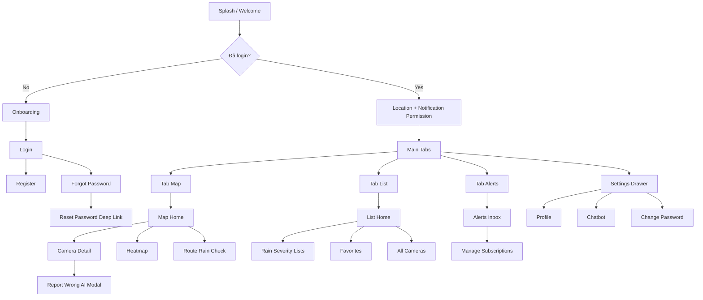

# HCMRainVision — Yêu Cầu Phần Mềm Backend (SRS)

> **Phiên bản:** 1.0  
> **Phạm vi:** Backend API + SignalR + Background Jobs  
> **Đối tượng đọc:** Mobile designer (Stitch), ChatGPT prompt engineering, dev team  
> **Tài liệu liên quan:** [`backend-project-description.md`](backend-project-description.md)

---

## Mục Lục

1. [Phần I — Yêu cầu chức năng (FR)](#phần-i--yêu-cầu-chức-năng-fr)
2. [Phần II — Yêu cầu phi chức năng (NFR)](#phần-ii--yêu-cầu-phi-chức-năng-nfr)
3. [Phần III — API Contract Summary](#phần-iii--api-contract-summary)
4. [Phần IV — Phân quyền](#phần-iv--phân-quyền)
5. [Phần V — SignalR Contract](#phần-v--signalr-contract)
6. [Phụ lục A — Map Backend → Mobile Screens](#phụ-lục-a--map-backend--mobile-screens)
7. [Phụ lục B — Prompt mẫu ChatGPT / Stitch](#phụ-lục-b--prompt-mẫu-chatgpt--stitch)
8. [Phụ lục C — So sánh với Mobile hiện tại](#phụ-lục-c--so-sánh-với-mobile-hiện-tại)

---

## Phần I — Yêu Cầu Chức Năng (FR)

> **Format mỗi FR:** Mô tả | Actor | Tiên quyết | Luồng chính | Luồng lỗi | API | Gợi ý màn mobile

---

### FR-AUTH-01: Đăng ký tài khoản

| Thuộc tính | Nội dung |
|------------|----------|
| **Mô tả** | Người dùng tạo tài khoản mới với username, email, password |
| **Actor** | Guest |
| **Tiên quyết** | Username và email chưa tồn tại |
| **Luồng chính** | 1. Gửi `RegisterDto` → 2. Backend hash BCrypt → 3. Tạo user role `User` → 4. Trả `{ message }` |
| **Luồng lỗi** | Username trùng → 400 "Username đã tồn tại"; Email trùng → 400 "Email đã được sử dụng" |
| **API** | `POST /api/auth/register` |
| **Request** | `{ username, email, password }` — password min 6 ký tự |
| **Response** | `200 { message: "Đăng ký thành công!" }` |
| **Màn mobile** | RegisterScreen |

---

### FR-AUTH-02: Đăng nhập

| Thuộc tính | Nội dung |
|------------|----------|
| **Mô tả** | Xác thực và nhận JWT |
| **Actor** | Guest |
| **Luồng chính** | Login → verify BCrypt → tạo JWT (expires 1 ngày) |
| **Luồng lỗi** | Sai credential → 400 "Username hoặc mật khẩu không đúng" |
| **API** | `POST /api/auth/login` |
| **Request** | `{ username, password }` |
| **Response** | `200 { token, username, role }` |
| **Màn mobile** | LoginScreen |

---

### FR-AUTH-03: Quên mật khẩu

| Thuộc tính | Nội dung |
|------------|----------|
| **Mô tả** | Gửi email reset password |
| **Actor** | Guest |
| **Luồng chính** | Tìm user by email → tạo token hex 64 bytes → expiry 15 phút → gửi email async |
| **Luồng lỗi** | Email không tồn tại → 400 |
| **API** | `POST /api/auth/forgot-password` |
| **Request** | `{ email }` |
| **Response** | `200 { message }` |
| **Lưu ý** | Link reset hardcode `http://localhost:5173/reset-password?token=...` — mobile cần deep link riêng |
| **Màn mobile** | ForgotPasswordScreen, ResetPasswordScreen (deep link) |

---

### FR-AUTH-04: Đặt lại mật khẩu

| Thuộc tính | Nội dung |
|------------|----------|
| **Mô tả** | Đổi password bằng token từ email |
| **Actor** | Guest |
| **Luồng chính** | Validate token + expiry → hash password mới → xóa token |
| **Luồng lỗi** | Token invalid/expired → 400 |
| **API** | `POST /api/auth/reset-password` |
| **Request** | `{ token, newPassword }` — min 6 ký tự |
| **Màn mobile** | ResetPasswordScreen |

---

### FR-AUTH-05: Xem hồ sơ

| Thuộc tính | Nội dung |
|------------|----------|
| **Mô tả** | Lấy thông tin profile user hiện tại |
| **Actor** | User (JWT) |
| **API** | `GET /api/auth/me` |
| **Response** | `UserProfileDto`: id, username, email, fullName, phoneNumber, avatarUrl, role |
| **Màn mobile** | ProfileScreen |

---

### FR-AUTH-06: Cập nhật hồ sơ

| Thuộc tính | Nội dung |
|------------|----------|
| **Mô tả** | Sửa fullName, phone, avatar |
| **Actor** | User (JWT) |
| **API** | `PUT /api/auth/me` |
| **Request** | `{ fullName?, phoneNumber?, avatarUrl? }` |
| **Response** | `200 { message }` |
| **Màn mobile** | EditProfileScreen |

---

### FR-AUTH-07: Đổi mật khẩu

| Thuộc tính | Nội dung |
|------------|----------|
| **Mô tả** | Đổi password khi đã đăng nhập |
| **Actor** | User (JWT) |
| **Luồng lỗi** | Old password sai → 400 |
| **API** | `POST /api/auth/change-password` |
| **Request** | `{ oldPassword, newPassword }` |
| **Màn mobile** | ChangePasswordScreen |

---

### FR-AUTH-08: Lưu vị trí GPS user

| Thuộc tính | Nội dung |
|------------|----------|
| **Mô tả** | Cập nhật `LastKnownLocation` cho route check fallback và report verify |
| **Actor** | User (JWT) |
| **API** | `POST /api/auth/location` |
| **Request** | `{ latitude: -90..90, longitude: -180..180 }` |
| **Response** | `200 { message: "Cập nhật vị trí thành công" }` |
| **Permission mobile** | Location (When In Use / Always) |
| **Màn mobile** | MapHome (background sync), LocationPermissionScreen |

---

### FR-AUTH-09: Đăng ký FCM Device Token *(GAP)*

| Thuộc tính | Nội dung |
|------------|----------|
| **Mô tả** | Lưu Firebase device token để nhận push cảnh báo mưa |
| **Actor** | User (JWT) |
| **Trạng thái** | **Chưa có API** — cột `users.device_token` tồn tại, worker đọc khi push |
| **Yêu cầu đề xuất** | `PUT /api/auth/device-token` body `{ deviceToken }` |
| **Màn mobile** | EnableAlertsScreen, Settings — cần gọi sau khi có endpoint |

---

### FR-CAM-01: Xem danh sách camera

| Thuộc tính | Nội dung |
|------------|----------|
| **Mô tả** | Liệt kê camera có phân trang, search, sort |
| **Actor** | Guest, User, Admin |
| **API** | `GET /api/camera` |
| **Query** | `search?`, `sortBy?` (name, name_desc), `page` (default 1), `pageSize` (default 10) |
| **Response** | `{ total, page, pageSize, data: [{ id, name, latitude, longitude, wardId, status, lastUpdatedAt, streamUrl }] }` |
| **UI states** | Loading skeleton, empty list, pagination load more |
| **Màn mobile** | AllCamerasListScreen, NearbyCamerasScreen, Map markers |

---

### FR-CAM-02: Quản trị camera *(Admin only)*

| Thuộc tính | Nội dung |
|------------|----------|
| **Mô tả** | CRUD camera + stream, demo mode, AI test |
| **Actor** | Admin |
| **API** | `POST/PUT/DELETE /api/camera`, `POST/PUT .../demo-image`, `PUT .../restore-stream`, `POST .../run-ai-test` |
| **Màn mobile** | AdminCamerasScreen, CameraFormScreen — **loại khỏi Stitch User flow** |

---

### FR-WTH-01: Xem dữ liệu mưa mới nhất (Map)

| Thuộc tính | Nội dung |
|------------|----------|
| **Mô tả** | Lấy weather logs 30 phút gần nhất để vẽ marker trên bản đồ |
| **Actor** | Guest, User |
| **API** | `GET /api/weather/latest` |
| **Response mỗi item** | id, cameraId, latitude, longitude, isRaining, rainLevel, trafficLevel, confidence, timeAgo, imageUrl, imageExpiresAtUtc, imageDeletedAtUtc, imageIsRedacted, aiModel, aiReason |
| **UI states** | Stale (>30 phút), no data, low confidence badge |
| **Màn mobile** | MapHomeScreen, AllCamerasMapScreen |

---

### FR-WTH-02: Heatmap mưa

| Thuộc tính | Nội dung |
|------------|----------|
| **Mô tả** | Điểm nhiệt mưa weighted by AI confidence |
| **Actor** | Guest, User |
| **API** | `GET /api/weather/heatmap` |
| **Response** | `[{ lat, lng, intensity }]` — intensity = confidence |
| **Màn mobile** | HeatmapScreen |

---

### FR-WTH-03: Đếm / liệt kê camera đang mưa

| Thuộc tính | Nội dung |
|------------|----------|
| **Mô tả** | Thống kê camera có mưa trong N phút |
| **Actor** | Guest, User |
| **API** | `GET /api/weather/raining-cameras/count?minutes=30` |
| **API** | `GET /api/weather/raining-cameras?minutes=30` |
| **Query** | minutes: 1–180 |
| **List response** | count, minutes, timeLimitUtc, data: [{ cameraId, cameraName, lat, lng, wardId, rainLevel, trafficLevel, confidence, lastRainAtUtc, imageUrl, ... }] |
| **Màn mobile** | ListHomeScreen badges, HeavyRainListScreen, AreasByRainStatusScreen |

---

### FR-WTH-04: Lịch sử weather logs (Debug)

| Thuộc tính | Nội dung |
|------------|----------|
| **Mô tả** | Xem logs chi tiết có filter ảnh |
| **Actor** | Dev / Admin (public API) |
| **API** | `GET /api/weather/logs?minutes=180&limit=100&onlyWithImages=false` |
| **Màn mobile** | Optional — CameraDetail history tab |

---

### FR-WTH-05: Chi tiết camera + rain log

| Thuộc tính | Nội dung |
|------------|----------|
| **Mô tả** | Kết hợp camera info + latest weather từ FR-WTH-01 hoặc raining-cameras |
| **Actor** | Guest, User |
| **Hiển thị** | rainLevel icon/color, trafficLevel, confidence %, ảnh redacted (nếu còn TTL), aiReason, attribution nguồn camera |
| **Màn mobile** | CameraDetailMapScreen |

---

### FR-WTH-REP-01: Báo cáo AI sai

| Thuộc tính | Nội dung |
|------------|----------|
| **Mô tả** | User báo trạng thái mưa thực tế khác AI |
| **Actor** | User (JWT) |
| **Tiên quyết** | Đã gọi FR-AUTH-08 gần đây để verify GPS |
| **API** | `POST /api/weather/report` |
| **Request** | `{ cameraId, isRaining, note? }` |
| **Response** | `{ message, isVerified }` — verified nếu GPS trong ~500m và fresh ≤30 phút |
| **Permission mobile** | Location required |
| **Màn mobile** | Modal "Báo cáo sai" trên CameraDetail |

---

### FR-ROUTE-01: Kiểm tra an toàn tuyến đường

| Thuộc tính | Nội dung |
|------------|----------|
| **Mô tả** | Phân tích mưa/kẹt xe dọc tuyến đi |
| **Actor** | Guest, User |
| **API** | `POST /api/weather/check-route` |
| **Request** | `CheckRouteRequest`: currentLatitude/Longitude?, originLatitude/Longitude?, destinationLatitude/Longitude?, routePoints: [{lat,lng}] |
| **Origin priority** | explicit origin → GPS current → stored user location (JWT) |
| **Response** | `isSafe`, `warnings[]`, `result: { isSafe, riskLevel, summary, recommendation }`, `routeInfo`, `rainInfo`, `dataQuality: { status, isSufficient, note }` |
| **riskLevel** | `thap`, `trung_binh`, `cao`, `chua_du_du_lieu` |
| **dataQuality.status** | `ok`, `limited`, `stale`, `no_coverage` |
| **Màn mobile** | RouteImpactScreen |

---

### FR-LOC-01: Tra cứu phường / cụm

| Thuộc tính | Nội dung |
|------------|----------|
| **Mô tả** | Danh sách phường cho picker subscription và filter |
| **Actor** | Guest, User |
| **API** | `GET /api/location/wards` |
| **API** | `GET /api/location/wards/{id}` |
| **API** | `GET /api/location/districts` — trả distinct cluster names |
| **API** | `GET /api/location/wards/by-district/{districtName}` |
| **Ward item** | wardId, wardName, districtName (cluster), alias |
| **Màn mobile** | AlertSubscriptionsScreen, AllAreasScreen, area filters |

---

### FR-FAV-01: Quản lý camera yêu thích

| Thuộc tính | Nội dung |
|------------|----------|
| **Mô tả** | CRUD favorites |
| **Actor** | User (JWT) |
| **API** | `GET /api/favorite` — trả full Camera entities |
| **API** | `POST /api/favorite/{cameraId}` |
| **API** | `DELETE /api/favorite/{cameraId}` |
| **Luồng lỗi** | Trùng → 400; Not found delete → 404 |
| **Màn mobile** | FavoriteCamerasScreen, FavoriteRainByWardScreen, heart icon on CameraDetail |

---

### FR-ALERT-01: Đăng ký cảnh báo mưa theo phường

| Thuộc tính | Nội dung |
|------------|----------|
| **Mô tả** | User chọn phường + ngưỡng nhạy cảm |
| **Actor** | User (JWT) |
| **API** | `GET /api/subscriptions` |
| **API** | `POST /api/subscriptions` — body `{ wardId, thresholdProbability: 0.7 }` |
| **API** | `PUT /api/subscriptions/{id}` — `{ thresholdProbability, isEnabled }` |
| **API** | `DELETE /api/subscriptions/{id}` |
| **Response item** | subscriptionId, wardId, wardName, districtName, thresholdProbability, isEnabled, createdAt |
| **Luồng lỗi** | Ward invalid → 400; Duplicate → 409 |
| **Màn mobile** | AlertSubscriptionsScreen, EnableAlertsScreen |

---

### FR-PUSH-01: Nhận push notification mưa

| Thuộc tính | Nội dung |
|------------|----------|
| **Mô tả** | FCM push khi camera trong phường đăng ký phát hiện mưa vượt ngưỡng |
| **Actor** | User (có deviceToken + subscription) |
| **Trigger** | RainScanningWorker sau AI predict |
| **Điều kiện** | isRaining + cooldown 30 phút/camera + confidence ≥ thresholdProbability |
| **Permission mobile** | Notifications |
| **Deep link** | Mở CameraDetail hoặc ward trên map |
| **Màn mobile** | EnableAlertsScreen, AlertsHomeScreen, system notification tray |

---

### FR-CHAT-01: Chatbot hỏi thời tiết

| Thuộc tính | Nội dung |
|------------|----------|
| **Mô tả** | Hỏi đáp tiếng Việt dựa dữ liệu mưa hệ thống |
| **Actor** | Guest, User |
| **API** | `POST /api/chatbot/message` |
| **Request** | `{ message }` — max 500 ký tự |
| **Response** | `{ reply }` |
| **API debug** | `GET /api/chatbot/debug` → `{ context }` |
| **Màn mobile** | ChatbotScreen |

---

### FR-RT-01: Cập nhật bản đồ realtime

| Thuộc tính | Nội dung |
|------------|----------|
| **Mô tả** | Nhận rain alert qua WebSocket không cần refresh |
| **Actor** | Guest, User |
| **Hub** | Connect `/rainHub` |
| **Client calls** | `JoinWardGroup(wardId)`, `JoinDashboard()`, `LeaveWardGroup(wardId)` |
| **Server event** | `ReceiveRainAlert` |
| **Màn mobile** | MapHomeScreen — cập nhật marker khi nhận event |

---

### FR-RT-02: Theo dõi route realtime *(Partial)*

| Thuộc tính | Nội dung |
|------------|----------|
| **Mô tả** | Đăng ký nhóm SignalR theo routeId |
| **Trạng thái** | `StartRouteMonitoring` / `StopRouteMonitoring` hoạt động; **`ReceiveRouteRainUpdate` chưa emit** |
| **Rủi ro** | `RouteMonitoringRegistry` có thể chưa DI — test trước khi thiết kế UI phụ thuộc |
| **Màn mobile** | RouteImpactScreen — chỉ dùng REST check-route hiện tại |

---

### FR-ADM-01: Quản trị hệ thống *(Admin only — không Stitch User)*

| Thuộc tính | Nội dung |
|------------|----------|
| **Mô tả** | Stats, users, ingestion, audit |
| **API** | `GET /api/admin/stats`, `audit-data`, `users`, `stats/*`, `ingestion-jobs`, `ingestion-stats` |
| **API** | `PUT /api/admin/users/{id}/ban` |
| **Màn mobile** | AdminStack (đã có trong mobile, loại khỏi prompt Stitch user) |

---

## Phần II — Yêu Cầu Phi Chức Năng (NFR)

### NFR-PERF-01: Hiệu năng API

| ID | Yêu cầu | Giá trị |
|----|---------|---------|
| NFR-PERF-01a | Camera list pagination default | pageSize = 10 |
| NFR-PERF-01b | Weather latest window | 30 phút |
| NFR-PERF-01c | AI parallel inference | MaxParallelism 1–3 |
| NFR-PERF-01d | HttpClient camera fetch timeout | 60s + Polly retry |
| NFR-PERF-01e | EF command timeout | 60s |
| NFR-PERF-01f | Admin camera health | < 50ms (read from DB, không crawl live) |

### NFR-SEC-01: Bảo mật

| ID | Yêu cầu | Chi tiết |
|----|---------|----------|
| NFR-SEC-01a | Password storage | BCrypt hash |
| NFR-SEC-01b | API auth | JWT Bearer, header `Authorization: Bearer {token}` |
| NFR-SEC-01c | Token TTL | 1 ngày |
| NFR-SEC-01d | Role-based access | `[Authorize(Roles = "Admin")]` |
| NFR-SEC-01e | JWT validation | Signature only — issuer/audience **không** validate |
| NFR-SEC-01f | Reset token | 15 phút expiry, single use |

### NFR-AVAIL-01: Sẵn sàng

| ID | Yêu cầu | Chi tiết |
|----|---------|----------|
| NFR-AVAIL-01a | Health liveness | `GET /health/live` |
| NFR-AVAIL-01b | Health readiness | `GET /health/ready` (PostgreSQL) |
| NFR-AVAIL-01c | Stuck job recovery | Reset `IngestionJob` status Running on worker startup |

### NFR-DATA-01: Dữ liệu & GIS

| ID | Yêu cầu | Chi tiết |
|----|---------|----------|
| NFR-DATA-01a | Coordinate system | WGS84 SRID 4326 |
| NFR-DATA-01b | Rain alert buffer | ~1km (0.009°) |
| NFR-DATA-01c | Report verify radius | ~500m (0.005°) |
| NFR-DATA-01d | Route coverage radius | ~3km (0.027°) |
| NFR-DATA-01e | Image retention | 24h default |
| NFR-DATA-01f | DB naming | snake_case tables/columns |

### NFR-AI-01: AI Provider

| ID | Yêu cầu | Chi tiết |
|----|---------|----------|
| NFR-AI-01a | Provider required | `OllamaQwen` hoặc `RemoteQwen` — startup fail nếu invalid |
| NFR-AI-01b | Low confidence threshold | < 0.6 → save image for review |
| NFR-AI-01c | Daily quota (RemoteQwen demo) | 160 inferences/day |
| NFR-AI-01d | Batch size | 20 cameras/scan |
| NFR-AI-01e | rain_level values | none, light, medium, heavy |
| NFR-AI-01f | traffic_level values | clear, slow, jam, unknown |

### NFR-NOTIF-01: Thông báo

| ID | Yêu cầu | Chi tiết |
|----|---------|----------|
| NFR-NOTIF-01a | Rain alert cooldown | 30 phút/camera |
| NFR-NOTIF-01b | FCM multicast batch | 500 tokens/batch |
| NFR-NOTIF-01c | SignalR groups | Dashboard + per WardId |
| NFR-NOTIF-01d | Email | SMTP async (không block API) |

### NFR-CORS-01: Cross-Origin

| Môi trường | Policy |
|------------|--------|
| Development | Any origin + credentials |
| Production | localhost + GitHub Pages origins |

### NFR-COMP-01: Tuân thủ dữ liệu camera

| ID | Yêu cầu |
|----|---------|
| NFR-COMP-01a | Không lưu ảnh raw |
| NFR-COMP-01b | Chỉ lưu ảnh redacted + TTL |
| NFR-COMP-01c | Không OCR / biển số / khuôn mặt |
| NFR-COMP-01d | UI attribution portal giao thông TP.HCM |
| NFR-COMP-01e | Route answer dùng log có sẵn — không on-demand scan cho user query |

### NFR-UX-01: Trạng thái UI mobile nên xử lý

| State | Điều kiện | UI gợi ý |
|-------|-----------|----------|
| Loading | API in-flight | Skeleton / spinner |
| Empty | Không có camera/log | Illustration + CTA refresh |
| Stale | Log > 30 phút | Badge "Dữ liệu cũ" màu vàng |
| Low confidence | confidence < 0.6 | Badge "AI không chắc" |
| Image expired | imageUrl null hoặc deleted | Placeholder "Ảnh đã hết hạn" |
| No coverage | route dataQuality = no_coverage | Warning banner |
| Offline | Network fail | ConnectionErrorScreen |
| Guest limited | Chưa login | Prompt login cho favorites/report/subscriptions |

---

## Phần III — API Contract Summary

**Base URL:** `http://{host}:5057` (dev)  
**Auth header:** `Authorization: Bearer {jwt_token}`

### Auth — `api/auth`

| Method | Path | Auth | Request Body | Response (200) | Mobile |
|--------|------|------|--------------|----------------|--------|
| POST | `/register` | None | RegisterDto | `{ message }` | Required |
| POST | `/login` | None | LoginDto | `{ token, username, role }` | Required |
| POST | `/forgot-password` | None | ForgotPasswordDto | `{ message }` | Required |
| POST | `/reset-password` | None | ResetPasswordDto | `{ message }` | Required |
| GET | `/me` | JWT | — | UserProfileDto | Required |
| PUT | `/me` | JWT | UpdateProfileDto | `{ message }` | Required |
| POST | `/change-password` | JWT | ChangePasswordDto | `{ message }` | Required |
| POST | `/location` | JWT | UpdateLocationDto | `{ message }` | Required |

### Camera — `api/camera`

| Method | Path | Auth | Query/Body | Response | Mobile |
|--------|------|------|------------|----------|--------|
| GET | `/` | None | search, sortBy, page, pageSize | Paginated camera list | Required |
| POST | `/` | Admin | CreateCameraRequest | camera + message | Admin-only |
| PUT | `/{id}` | Admin | UpdateCameraRequest | camera entity | Admin-only |
| DELETE | `/{id}` | Admin | — | `{ message }` | Admin-only |
| POST | `/{id}/demo-image` | Admin | multipart file | message, streamUrl, imageUrl | Admin-only |
| PUT | `/{id}/demo-image` | Admin | `{ fileName }` | message, streamUrl | Admin-only |
| PUT | `/{id}/restore-stream` | Admin | `{ streamUrl, streamType? }` | message | Admin-only |
| POST | `/{id}/run-ai-test` | Admin | `{ saveWeatherLog? }` | prediction details | Admin-only |

### Weather — `api/weather`

| Method | Path | Auth | Query/Body | Response | Mobile |
|--------|------|------|------------|----------|--------|
| GET | `/latest` | None | — | Array weather log DTOs | Required |
| GET | `/logs` | None | minutes, limit, onlyWithImages | `{ count, data[] }` | Optional |
| GET | `/raining-cameras/count` | None | minutes (1-180) | `{ count, minutes, timeLimitUtc }` | Required |
| GET | `/raining-cameras` | None | minutes | `{ count, data[] }` | Required |
| GET | `/heatmap` | None | — | `[{ lat, lng, intensity }]` | Required |
| POST | `/report` | JWT | ReportDto | `{ message, isVerified }` | Required |
| POST | `/check-route` | None* | CheckRouteRequest | Route safety payload | Required |
| POST | `/test-ai` | None | multipart image | AI prediction | Optional (dev) |

### Location — `api/location`

| Method | Path | Auth | Response | Mobile |
|--------|------|------|----------|--------|
| GET | `/wards` | None | Ward[] | Required |
| GET | `/wards/{id}` | None | Ward detail | Optional |
| GET | `/districts` | None | string[] clusters | Required |
| GET | `/wards/by-district/{name}` | None | Ward[] | Required |

### Favorites — `api/favorite`

| Method | Path | Auth | Response | Mobile |
|--------|------|------|----------|--------|
| GET | `/` | JWT | Camera[] | Required |
| POST | `/{cameraId}` | JWT | `{ message }` | Required |
| DELETE | `/{cameraId}` | JWT | `{ message }` | Required |

### Subscriptions — `api/subscriptions`

| Method | Path | Auth | Body | Response | Mobile |
|--------|------|------|------|----------|--------|
| GET | `/` | JWT | — | AlertSubscriptionResponseDto[] | Required |
| POST | `/` | JWT | CreateSubscriptionDto | Created subscription | Required |
| PUT | `/{id}` | JWT | UpdateSubscriptionDto | `{ message }` | Required |
| DELETE | `/{id}` | JWT | — | `{ message }` | Required |

### Chatbot — `api/chatbot`

| Method | Path | Auth | Body | Response | Mobile |
|--------|------|------|------|----------|--------|
| POST | `/message` | None | `{ message }` | `{ reply }` | Required |
| GET | `/debug` | None | — | `{ context }` | Optional |

### Admin — `api/admin` *(Admin only)*

| Method | Path | Query | Mobile |
|--------|------|-------|--------|
| GET | `/stats` | — | Admin-only |
| GET | `/audit-data` | — | Admin-only |
| GET | `/users` | search, sortBy, page, pageSize | Admin-only |
| PUT | `/users/{id}/ban` | — | Admin-only |
| GET | `/stats/rain-frequency` | — | Admin-only |
| GET | `/stats/failed-cameras` | — | Admin-only |
| GET | `/stats/check-camera-health` | — | Admin-only |
| GET | `/ingestion-jobs` | page, pageSize, status | Admin-only |
| GET | `/ingestion-jobs/{jobId}` | — | Admin-only |
| GET | `/ingestion-stats` | days (default 7) | Admin-only |

### Health (non-controller)

| Method | Path | Mobile |
|--------|------|--------|
| GET | `/health/live` | Optional |
| GET | `/health/ready` | Optional |

---

## Phần IV — Phân Quyền

| Capability | Guest | User (JWT) | Admin |
|------------|:-----:|:----------:|:-----:|
| Xem map / weather / camera list | ✓ | ✓ | ✓ |
| Heatmap, raining cameras, route check | ✓ | ✓ | ✓ |
| Chatbot | ✓ | ✓ | ✓ |
| Favorites | ✗ | ✓ | ✓ |
| Alert subscriptions | ✗ | ✓ | ✓ |
| Report incorrect AI | ✗ | ✓ | ✓ |
| Profile / change password | ✗ | ✓ | ✓ |
| Save GPS location | ✗ | ✓ | ✓ |
| SignalR realtime | ✓ | ✓ | ✓ |
| Camera CRUD / AI test | ✗ | ✗ | ✓ |
| Admin dashboard | ✗ | ✗ | ✓ |

---

## Phần V — SignalR Contract

**URL:** `ws://{host}:5057/rainHub` (negotiate qua SignalR client)

### Client → Server

```typescript
// Join nhận alert toàn hệ thống
hub.invoke("JoinDashboard");

// Join nhận alert theo phường (wardId = Ward.WardId string)
hub.invoke("JoinWardGroup", wardId);
hub.invoke("LeaveWardGroup", wardId);

// Route monitoring (partial backend support)
hub.invoke("StartRouteMonitoring", {
  routeId?: string,
  origin?: string,
  destination?: string,
  routePoints: [{ lat: number, lng: number }]  // min 2 points
});
hub.invoke("StopRouteMonitoring", { routeId: string });
```

### Server → Client

```typescript
// Rain alert — emit từ RainScanningWorker
hub.on("ReceiveRainAlert", (data: {
  cameraId: string;
  cameraName: string;
  wardName?: string;
  districtName?: string;
  imageUrl?: string;
  rainLevel: string;      // none|light|medium|heavy
  trafficLevel: string;   // clear|slow|jam|unknown
  isRaining: boolean;
  confidence: number;
  timestamp: string;      // UTC ISO
}) => { /* update map marker */ });

// Route ACK
hub.on("RouteMonitoringStarted", (data: { routeId, group, timestamp }) => {});
hub.on("RouteMonitoringStopped", (data: { routeId, timestamp }) => {});

// CHƯA IMPLEMENT:
// hub.on("ReceiveRouteRainUpdate", ...)
```

---

## Phụ Lục A — Map Backend → Mobile Screens

> Dùng bảng này làm checklist khi nhờ ChatGPT/Stitch thiết kế UI. Bao gồm navigation flow, modals, empty/error states.

### A.1 Navigation Flow Đề Xuất



### A.2 Danh Sách Màn Hình Chi Tiết

| # | Màn hình | FR/API | Fields hiển thị chính | Actions | Auth | Permissions |
|---|----------|--------|----------------------|---------|------|-------------|
| 1 | **Splash / Welcome** | — | Logo, tagline, attribution camera portal | Continue | Guest | — |
| 2 | **Onboarding** (3 slides) | — | Giới thiệu map, alerts, route | Skip / Next | Guest | — |
| 3 | **Login** | FR-AUTH-02 | username, password | Login, → Register, → Forgot | Guest | — |
| 4 | **Register** | FR-AUTH-01 | username, email, password, confirm | Register | Guest | — |
| 5 | **Forgot Password** | FR-AUTH-03 | email | Send reset | Guest | — |
| 6 | **Reset Password** | FR-AUTH-04 | token (deep link), newPassword | Reset | Guest | — |
| 7 | **Location Permission** | FR-AUTH-08 | Giải thích GPS cho report/route | Allow / Skip | User | Location |
| 8 | **Notification Permission** | FR-PUSH-01 | Giải thích push mưa | Allow / Later | User | Notifications |
| 9 | **Map Home** | FR-WTH-01, FR-RT-01 | Map markers colored by rainLevel, raining count badge | Tap marker, Heatmap, Route, Locate me, Refresh | Guest+ | Location optional |
| 10 | **Camera Detail** | FR-CAM-01, FR-WTH-01 | name, rainLevel, trafficLevel, confidence, image, aiReason, timeAgo, ward | Favorite, Report, Share | Guest+ | Location for report |
| 11 | **Report AI Modal** | FR-WTH-REP-01 | Toggle isRaining, note textarea | Submit | User | Location required |
| 12 | **Heatmap** | FR-WTH-02 | Heat overlay, legend | Back, toggle layer | Guest+ | — |
| 13 | **Route Rain Check** | FR-ROUTE-01 | Map polyline, origin/dest pins, result card | Check route, swap origin/dest | Guest+ | Location |
| 14 | **List Home** | FR-WTH-03 | Cards: heavy/medium/light rain counts | Navigate to lists | Guest+ | — |
| 15 | **Rain List (by severity)** | FR-WTH-03 | cameraName, rainLevel, ward, lastRainAt | Tap → Camera Detail | Guest+ | — |
| 16 | **All Cameras List** | FR-CAM-01 | Search, sort, paginated list | Tap → Detail, Favorite | Guest+ | — |
| 17 | **Favorites** | FR-FAV-01 | Favorite cameras with rain status | Remove, Tap detail | User | — |
| 18 | **Areas / Wards** | FR-LOC-01 | Ward list grouped by cluster | Tap → map filter | Guest+ | — |
| 19 | **Alerts Home** | FR-PUSH-01, FR-RT-01 | Inbox realtime + push history | Tap → camera/ward, Mark read | User | Notifications |
| 20 | **Alert Subscriptions** | FR-ALERT-01, FR-LOC-01 | Ward picker, threshold slider 0-100%, enabled toggle | Add, Edit, Delete | User | — |
| 21 | **Chatbot** | FR-CHAT-01 | Chat bubbles, input max 500 chars | Send, Clear | Guest+ | — |
| 22 | **Settings** | — | Menu links | → Profile, Subscriptions, Chatbot, Logout | User | — |
| 23 | **Profile** | FR-AUTH-05 | avatar, fullName, email, phone | Edit profile | User | — |
| 24 | **Edit Profile** | FR-AUTH-06 | fullName, phone, avatarUrl | Save | User | — |
| 25 | **Change Password** | FR-AUTH-07 | old, new, confirm | Save | User | — |
| 26 | **Connection Error** | — | Error message, retry | Retry | All | — |
| 27 | **No Data** | — | "Chưa có dữ liệu mưa" | Refresh | All | — |
| 28 | **Offline Mode** | — | Cached data indicator | Continue offline | All | — |
| 29 | **Attribution Footer** (component) | NFR-COMP-01 | Link portal giao thông TP.HCM | Open browser | All | — |

### A.3 Modals & Bottom Sheets

| Component | Trigger | Nội dung |
|-----------|---------|----------|
| Filter Sheet | Map Home filter button | rainLevel multi-select, ward/cluster |
| Camera Quick Preview | Tap marker | Mini card → View detail |
| Subscription Add Sheet | Alerts tab + | Ward search, threshold slider |
| Login Prompt Sheet | Guest tap favorite/report | CTA Login / Register |

### A.4 Empty / Error States Copy (Tiếng Việt)

| State | Copy gợi ý |
|-------|------------|
| No rain data | "Chưa có dữ liệu mưa trong 30 phút qua. Hãy thử lại sau." |
| Stale data | "Dữ liệu cập nhật {timeAgo} — có thể không còn chính xác." |
| Low confidence | "AI không chắc chắn ({confidence}%). Hãy tham khảo thêm nguồn khác." |
| Image expired | "Ảnh minh họa đã hết hạn (lưu tối đa 24 giờ)." |
| Route no coverage | "Không có camera gần tuyến đường. Kết quả chỉ mang tính tham khảo." |
| GPS required | "Bật định vị để xác thực báo cáo và kiểm tra tuyến đường chính xác hơn." |
| Login required | "Đăng nhập để lưu camera yêu thích và nhận cảnh báo mưa." |

---

*Kết thúc tài liệu requirements. Dùng kèm [`backend-project-description.md`](backend-project-description.md) khi gửi cho ChatGPT hoặc Stitch.*
